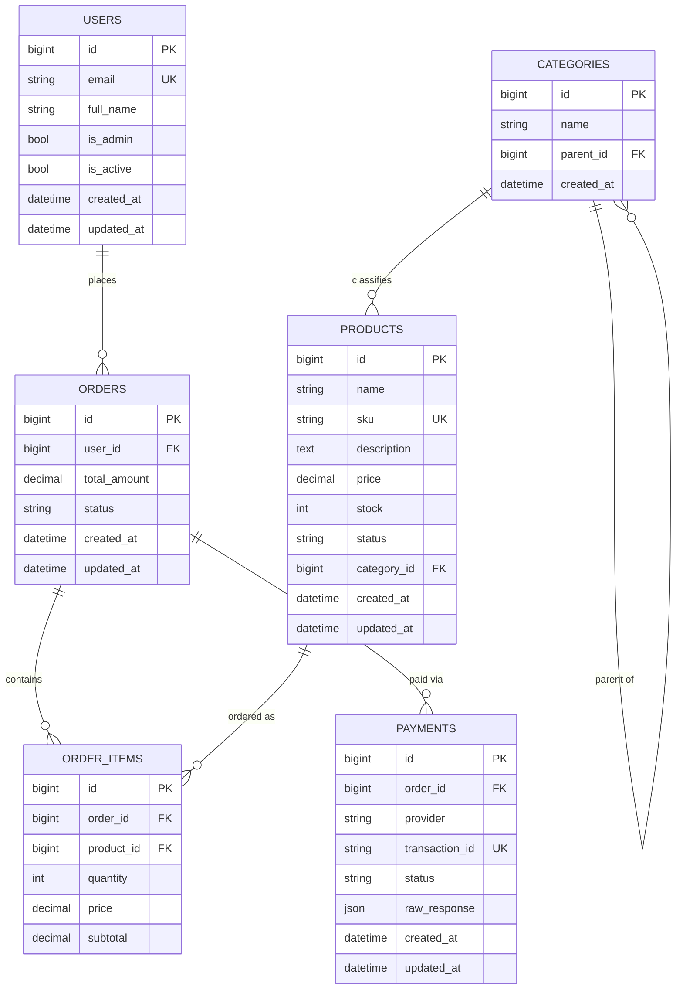

# Entity-Relationship Diagram

## Notes

- `products.sku` and `payments.transaction_id` are unique and indexed for fast lookups.
- `orders.status` moves `pending -> paid` or `pending -> canceled`; a `paid`
  order cannot be canceled directly (enforced in `OrderService.cancel`).
- `order_items.price` / `subtotal` are **snapshots** taken at order-creation
  time, so a later change to `products.price` never rewrites historical
  orders.
- `categories.parent_id` is self-referencing, forming the tree that
  `CategoryTreeService` walks with DFS and caches in Redis.
- Indexes exist on all foreign keys plus `products.sku`, `products.status`,
  `orders.status`, `payments.provider`, `payments.status` to keep the
  common list/filter queries fast as data grows.
