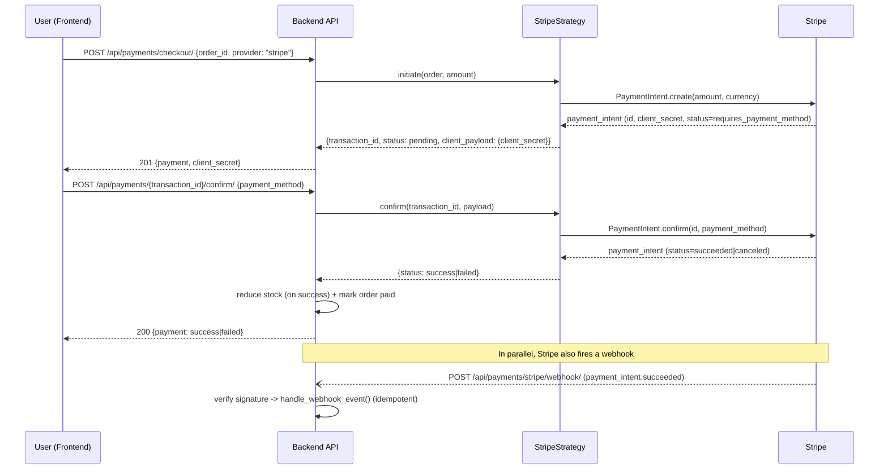
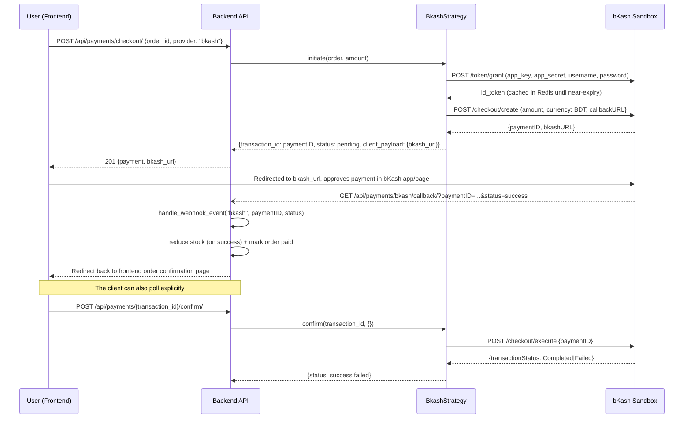

# Payment Flow Diagrams

## Stripe

## bKash (Tokenized Checkout, sandbox)

## Shared failure/retry behavior

- A `failed` payment never touches stock or the order's status - the order
  stays `pending`, so the user can retry checkout with a different
  provider (`POST /api/payments/checkout/` again with `provider` switched).
- Both webhook/callback and the client-driven `confirm` endpoint route
  through the same `PaymentService` methods, so stock is only ever reduced
  once per order regardless of which path resolves the payment first
  (`Order.status != paid` is checked before reducing stock in the webhook
  path).
